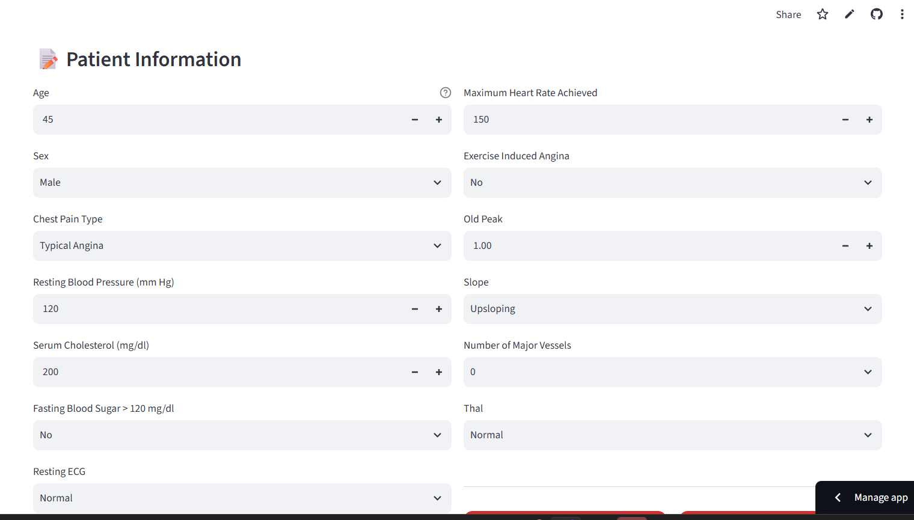
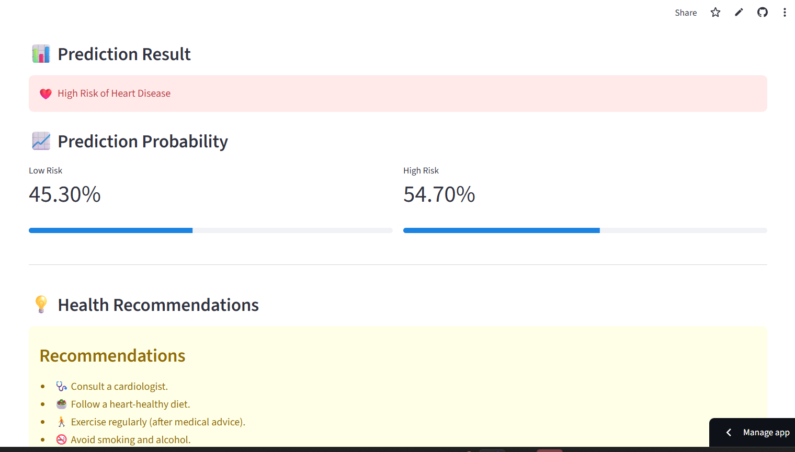

# ❤️ Heart Disease Prediction System

### AI-Powered Risk Assessment Web App | Machine Learning · Streamlit · Deployment

**[🚀 Live Demo](https://heart-disease-prediction-ml-zewwcqrssxuzr8b3urtueg.streamlit.app)** &nbsp;|&nbsp; **[📂 Source Code](https://github.com/LAXMI15PRIYA/heart-disease-prediction-ml)**

---

## 📌 About the Project

A complete, deployed **end-to-end Machine Learning application** that predicts a patient's risk of heart disease from 13 clinical parameters, using a **Logistic Regression** model trained on the UCI Heart Disease dataset. The project covers the full pipeline: **data preprocessing → model training → evaluation → building an interactive UI → cloud deployment.**

> ⚠️ **Disclaimer:** Built for educational and portfolio purposes only. Not intended for real medical diagnosis.

---

## 🖥️ Demo

| Patient Input Form | Risk Prediction Output |
|:---:|:---:|
|  |  |

---

## 🎯 What This Project Demonstrates

- ✅ Ability to take an ML model from **training to a live, usable product**
- ✅ Clean **data preprocessing** using `StandardScaler`
- ✅ Building an **interactive, user-friendly UI** with Streamlit and custom CSS
- ✅ Working with **real-world healthcare data** and interpreting model probabilities
- ✅ **Deploying and hosting** a live ML application on Streamlit Cloud
- ✅ Writing clean, structured, well-documented Python code

---

## ✨ Features

- 🔍 Predicts heart disease risk from 13 medical features in real time
- 📊 Shows prediction confidence with Low Risk vs High Risk probability bars
- 💡 Generates personalized health recommendations based on the result
- 🎨 Clean, responsive UI with custom-styled components
- ⚡ Instant predictions powered by a pre-trained, serialized model

---

## 🧠 Model Details

| Component | Details |
|---|---|
| **Algorithm** | Logistic Regression |
| **Preprocessing** | StandardScaler |
| **Features Used** | 13 clinical parameters |
| **Training Accuracy** | 85.25% |
| **Dataset** | UCI Heart Disease Dataset (303 records) |

---

## 🛠️ Tech Stack
